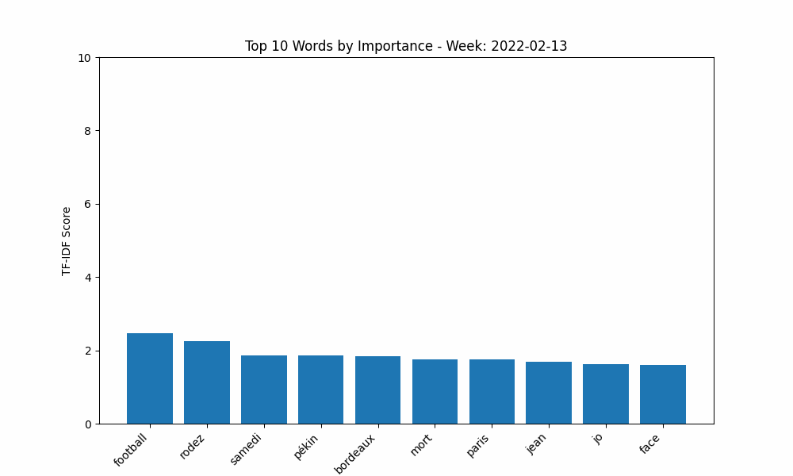

# Event detection from news articles

We have a dataset of approximately 100 000 newspaper articles. The goal is to detect events from these articles.

## Data cleaning

Data is first loaded and cleaned in [data-exploration.ipynb](./data-exploration.ipynb).

It is then exported to a new jsonl file named `newspapers_filtered_{date_of_exportation}.jsonl`

As a second step, we remove from the dataset rows having a too long common prefix. This is done in [remove_articles_with_common_prefixes.ipynb](./remove_articles_with_common_prefixes.ipynb).

This allows us to get rid of article titles where the structure is the same but the content is different such as :

```
Météo, prévisions en Normandie pour le lundi 7 mars
Météo, prévisions en Normandie pour le dimanche 3 avril
Météo, prévisions en Normandie pour le dimanche 10 avril
Météo, prévisions pour le mardi 19 avril en Normandie
```

## TF-IDF

We use a classic TF-IDF method to extract the most important words from the articles. The code is in [tf-idf.ipynb](./tf-idf.ipynb).



## Embedding, Clustering, and generation of a unified title for each cluster

I wrote details about the results in this [notion page](https://supermuel.notion.site/UMAP-HDBSCAN-LLM-173755fdedab4bfc990f5dd95df337c4?pvs=4).

### Embedding

We generate an embedding of each title using Mistral's embedding API, which gives us a 1024-dimensional vector representation of each title.

The embedding is done in [embedding.ipynb](./embedding.ipynb). The resulting file is an exported numpy array.

### Clustering

We use the HDBSCAN clustering algorithm to cluster the articles. The code is in [hdbscan.ipynb](./hdbscan.ipynb).

The algorithm uses the embeddings and the date to group articles with similar titles and dates together.

### Title generation

For each cluster, we generate a unified title using an LLM.

### API Keys

To reproduce the results, you need to have access to the Mistral API for embeddings, and Anthropic API for title generation.

Create a `.env` file with the following format and the API keys

```
MISTRAL_API_KEY=<your Mistral API key>
ANTHROPIC_API_KEY=<your Anthropic API key>
```
